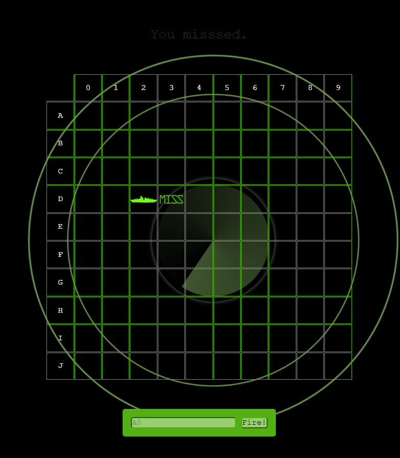

# Battleship - A strategy type guessing game

This is a game I developed to practice my HTML, CSS, and JS skills and to create something.

## Table of contents

- [Overview](#overview)
  - [The challenge](#the-challenge)
  - [Screenshot](#screenshot)
  - [Links](#links)
- [My process](#my-process)
  - [Built with](#built-with)
  - [Changes made](#changes-made)
  - [What I learned](#what-i-learned)
  - [Continued development](#continued-development)
  - [Useful resources](#useful-resources)
- [Author](#author)

## Overview

### The challenge

The challenge was to build a browser app where the browser would hide ships and the player's job was to seek them out and destroy them in the fewest number of guesses. To succeed, it'd need to do the following:
 - represent the ships
   - the ships must be on the board
   - the ships must not overlap
   - the ships must be randomly placed
 - get the users' input
   - the user should be able to input a cell location in a GUI element
 - check the users' guess vs the ship's location
 - display the result: hit, miss, or ship sunk
 - record how many guesses were used and display that

### Screenshot



### Links

- Live Site URL: [Battleship](https://caius-scipio.github.io/Battleship/)

## My process

### Built with

- Semantic HTML5 markup
- CSS custom properties
- JavaScript

### Changes made

This game was modeled after the Head First Battleship game found within their JavaScript Programming book. However, here are the changes I made to make it uniquely mine:

- Board changes I made:
  - removed the background image
  - added the radar sweep and added the expanding circles
  - reorganized the messages to the top, the board to the middle, and fire button to the bottom
  - made the game responsive
  - incresed the size of the game to a 10 x 10 grid
- Player interaction changes I made:
  - changed the text input to allow for lower and uppercase inputs
  - added the ability to use the mouse inputs instead of text inputs
  - changed the message area to blink the results
- Hits and Misses changes I made:
  - added sound effects to each hit and miss
  - modified the sound effects to restart whith each click
  - adjusted the volume to a more reasonable level
- Model changes I made:
  - increased the number of ships on the board
- Fire Control changes I made:
  - allowed for mouse input
  - prevented further inputs after the game was won

### What I learned

Making this game was a pleasure, and if I had to summarize the three major takeaways, I'd have to say:
- Organizing a program
- Learning how to link the bits and pieces of code together into a coherent function
- With each object having one responsibility, I learned how to walk though several steps of code to debug problems.

Here is some code I am particularly proud of, or think was interesting:

```css
.container::after, .container::before {
  .
  .
  .
  animation: ripple 5s infinite linear;
}

.container::after {
  animation-delay: 1.5s;
}

.sweep {
  .
  .
  .
  animation: sweep 8s infinite linear;
}

@keyframes sweep {
  to {
    transform: rotate(360deg);
  }
}

@keyframes ripple {
  to {
    transform: scale(3.12);
  }
}
```
```js
function handleCellClick(event) {
  let cellEvent = event.target;
  let location = cellEvent.id;
  let row = parseInt(location[0]);
  let column = parseInt(location[1]);

  if (row < 0 || row >= model.boardSize || column < 0 || column >= model.boardSize) {
    alert("Oops, that's off the board!");
    return;
  }

  let alphabet = ["A", "B", "C", "D", "E", "F", "G", "H", "I", "J"];
  let alphanumericLocation = alphabet[row] + column;

  controller.processGuess(alphanumericLocation.toUpperCase());
};
```

### Continued development

This game is not quite done yet. Here are some things I'd like to do in the future with it:
  - Add background music
  - Add a start screen with instructions
  - Add a menu so the user can adjust the volume
  - Add a mode to play against the computer
  - Allow the user to place ships on a board to play against the computer
  - Add logic for a computer to play against the user

### Useful resources

- [Head First JavaScript Programming](https://www.oreilly.com/library/view/head-first-javascript/9781449340124/) - This is where I got the idea from.
- [Web Boss JavaScript 30](https://javascript30.com/) - This course taught a few principles needed that made a few functions work.
- [w3schools](https://www.w3schools.com/) - My reference to remember the syntaxt and possibilites.

## Author

- Website - [Caius Scipio](https://caius-scipio.github.io/Portfolio/)